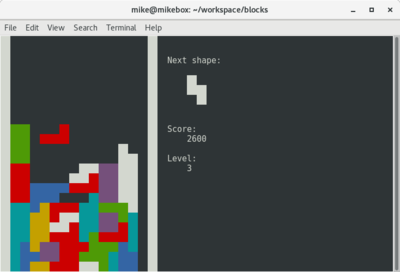

Blocks [](https://travis-ci.org/mike42/blocks)
================

This is a simple text-based tetris clone for Linux.



Compiling
--------------
You will need ncurses and cmake to compile this. On Debian:


```bash
apt-get install cmake libncurses5-dev
```

And then:

```bash
cmake .
make
./blocks
```

Controls
-------------
* Move: Right, down, left
* Rotate: Up
* Drop: Spacebar
* Quit: q

